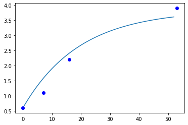
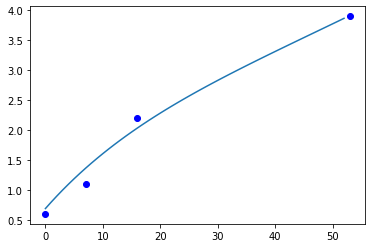
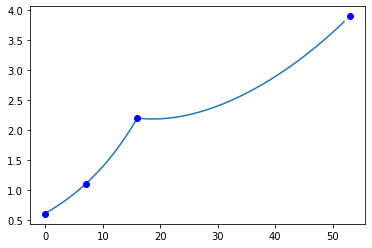
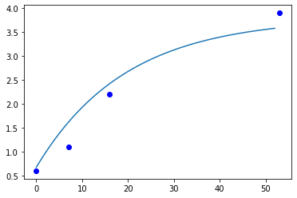
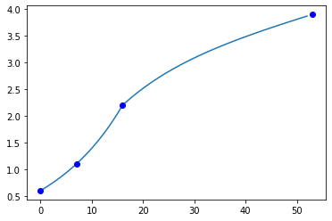
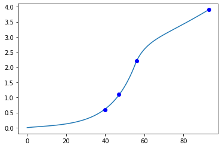

### Case Study 02
### by Nils Gandlau (ID: 5467868)

---

```python
import matplotlib.pyplot as plt
from scipy.optimize import minimize, least_squares, curve_fit
import numpy as np
```

# Firm Valuation of Dollar Shave Club

Dollar Shave Club is a subscription service that delivers fresh razors / razor blades each month to its customers.

To come up with an evaluation of the firm, we 

1. model the growth of the customer base
1. estimate the CLV of a subscriber
1. Combine (1) and (2) to compute the ovarall firm valuation

In this case study, a large problem was that there are no reports on the number of acquired customers. To get estimates for those numbers, we build and fit a simple model of customer base growth.

# Modeling the growth of the customer base

## Publicly available data

Scraping the internet for information, we have found some data on the **total number of subscribers** as well as estimations of Dollar Shave Club's subscribers' **retention rates**.

Concerning the **number of subscribers**, we have found the following data:

| date | subscribers (Mio) |
|-|-|
|May 2014|0.6|
|Dec 2014|1.1|
|Sep 2015|2.2|
|Oct 2018|3.9|

Concerning the **retention rate** of Dollar Shave Club's subscribers, we have found the following data:

* After 1 year, 50% are still subscribers
* After 4 years, 24% are still subscribers

We have further found third party estimates of Dollar Shave Club's retention rates on a more granular level (note that we have left out some columns for visual convenience).

|t=0|t=1|t=2|t=3|t=4|...|t=12|...|t=16|...|t=20|...|t=24|
|-|-|-|-|-|-|-|-|-|-|-|-|-|
|100%|80%|75%|65%|59%|...|44%|...|39%|...|36%|...|34%|

Using this data on retention rates, we have first computed the month-by-month retention rate, and then averaged over all 24 periods (months). **This yielded a mean retention rate of approx. 95%**. The high value is mostly driven by later periods, where almost all of the subscribers in a given month also remain in the subsequent month.

Even though a 95% retention rate seems very high, it is consistent with articles found on the internet, which claim that Dollar Shave Clubs has exceptionally high retention rates, similar or even better than those of Netflix.

## A simple model for the growth of the subscriber base

The first model of subscriber growth that we fit to the data is very simple. It makes the following assumptions:

* constant number of monthly acquired customers (ie, the same (absolute) number of customers join month-by-month)
* constant retention rate over time

The model will learn the following parameters:

* the initial number of customers (ie, those in period $t=0$). In this model, $t=0$ corresponds to the first month on which we have found data online, namely May 2014.
* the retention rate
* the number of customers that join each month


```python
class SimpleModel:
    """A simple model of customer growth"""
    
    def __init__(self, params):
        self.n0, self.nAcq, self.r = params
        
    def nAcquired(self, t):
        return self.nAcq
    
    def nCust(self, t):
        if t == 0:
            return self.n0
        else:
            nt = self.nCust(t-1) * self.r + self.nAcquired(t)
            return nt
```

Next, we define the loss function as well as functions that will fit our models and plot them.

The loss is defined as the **sum of squared difference** between the **predicted number of customers at period t** and the **observed number of customer at period t**, for those periods for which we have data.


```python
def loss(params, data):
    m = SimpleModel(params)
    SSR = sum([(m.nCust(t) - nt)**2 for t, nt in data])
    return SSR
    
def fit(data, params0, bounds):
    fit = minimize(loss, params0, args=(data), bounds=bounds, method="L-BFGS-B")
    return fit.x

def plot(fittedModel, data):
    observed = [n/1e6 for t, n in data]
    periods = [t for t, n in data]
    preds = [fittedModel.nCust(t)/1e6 for t in range(max(periods))]

    plt.plot(preds)
    plt.plot(periods, observed, 'bo')
    plt.show()
```

We fit the model with restrictions on the parameters. The **restrictions are made based on the data we have found on the internet**, namely:

* initially, the firm has 600 000 subscribers. Hence we limit the range of the initial number of subscribers to $[550 Mio, 650 Mio]$.
* the firm has high retention rates. Hence we limit the range of the estimated retention rate to $[0.8, 0.95]$


```python
# Publicly available data of total # of subscribers
# The tuples have the form: (month, # of subscribers)
data = [(0, 600000), (7, 1.1e6), (16, 2.2e6), (53, 3.9e6)]
```


```python
# Define value ranges for the model's parameters
boundsN0 = (550000, 650000)
boundsNAcq = (0, 10e6)
boundsRetentionRate = (0.8, 0.95)
bounds = (boundsN0, boundsNAcq, boundsRetentionRate)

# Initial values of the parameters
initialParams = [600000, 10000, 0.9]

fitted = fit(data, initialParams, bounds)

print(f"Initial # subscribers: {round(fitted[0])}")
print(f"# monthly acquired subscribers: {round(fitted[1])}")
print(f"retention rate: {fitted[2]}")

plot(SimpleModel(fitted), data)
```

    Initial # subscribers: 600910.0
    # monthly acquired subscribers: 191806.0
    retention rate: 0.95
    





This model estimates, that Dollar Shave Club ...

* has a 95% mean retention rate
* acquires on average 191,806 customers each month

Note that this simple model of subscriber growth doesn't really perform well on the first 3 data points. Hence, we try to extend the model further:

## Extension 1 of the model

W extend the first model by the following feature:

We allow the number of montly acquired subscribers to grow over time. That is, after finding the number of acquired customers in $t=1$, we assume that the number of acquired customers grows each month by rate $g \in [0,1]$. 

Example:

* Number of customers acquired in $t=1$ was 100
* Growth rate is found to be $g=0.1$.
* Then, in $t=2$ the model predicts the number of acquired customers to be $100*1.1=110$.
* Then, in $t=3$ the model predicts the number of acquired customers to be $100*1.1^2=121$.

and so on.


```python
class SimpleModel:
    """Simple model of customer growth"""
    def __init__(self, params):
        self.n0, self.nAcq0, self.g, self.r = params
        
    def nAcquired(self, t):
        return self.nAcq0 * (1+self.g)**t
    
    def nCust(self, t):
        if t == 0:
            return self.n0
        else:
            nt = self.nCust(t-1) * self.r + self.nAcquired(t)
            return nt
```


```python
boundsN0 = (500000, 1e6)
boundsNAcq0 = (0,1e6)
boundsg = (0, 1)
boundsr = (0.8, 0.95)

bounds = (boundsN0, boundsNAcq0, boundsg, boundsr)
initialParams = [600000, 10000, 0.1, 0.9]

fitted = fit(data, initialParams, bounds)

print(f"Initial # subscribers: {round(fitted[0])}")
print(f"# monthly acquired subscribers: {round(fitted[1])}")
print(f"growth of monthly acquired subscribers: {round(fitted[2], 2)}")
print(f"retention rate: {fitted[3]}")

plot(SimpleModel(fitted), data)
```

    Initial # subscribers: 689520.0
    # monthly acquired subscribers: 140034.0
    growth of monthly acquired subscribers: 0.01
    retention rate: 0.95
    





We first note that the model curve fits the data slightly better than the first model. The model found the following parameters:

* Initial number of subscribers: 689,520
* 140,000 subscribers joined in $t=1$
* Each month, the number of acquired subscribers grows by $1$%
* The retention rate is 95%.

However, the first 3 data points show a rather exponential growth -- which our model isn't really able to explain well.

That's why we try another extension:

## Extension 2 

Note that in the last figure, we seem to overestimate the _absolute_ number of monthly acquired subscribers in the first 20 periods, but underestimate the growth. Hence, we now **allow for the growth rate of monthly acquired subscribers to change over time**.

To be precise, we estimate

* a growth rate of monthly acquired subscribers for $t=0$ until $t=16$ (t=16 being the third data point)
* a growth rate of monthly acquired subscribers for $t=17$ until $t=52$ (t=52 being the fourth data point)


```python
class SimpleModel:
    """Simple model of customer growth"""
    def __init__(self, params):
        self.n0 = params[0]
        self.nAcq0 = params[1]
        self.gPeriod0to16 = params[2]   # first growth rate
        self.gPeriod17toInf = params[3] # second growth rate
        self.r = params[4]
        
    def nAcquired(self, t):
        g = 0
        if t <= 16:
            g = self.gPeriod0to16
        else:
            g = self.gPeriod17toInf
        return self.nAcq0 * (1+g)**t
    
    def nCust(self, t):
        if t == 0:
            return self.n0
        else:
            nt = self.nCust(t-1) * self.r + self.nAcquired(t)
            return nt
```


```python
boundsN0 = (500000, 1e6)
boundsNAcq0 = (0,1e6)
boundsg = (0, 1)
boundsr = (0.8, 0.95)

bounds = (boundsN0, boundsNAcq0, boundsg, boundsg, boundsr)

initialParams = [600000, 10000, 0.1, 0.1, 0.9]
fitted = fit(data, initialParams, bounds)

print(f"Initial # subscribers: {round(fitted[0])}")
print(f"# monthly acquired subscribers: {round(fitted[1])}")
print(f"growth of monthly acquired subscribers in year 0-2: {round(fitted[2], 2)}")
print(f"growth of monthly acquired subscribers in year 3-4: {round(fitted[3], 2)}")
print(f"retention rate: {fitted[3]}")

plot(SimpleModel(fitted), data)
```

    Initial # subscribers: 609880.0
    # monthly acquired subscribers: 92141.0
    growth of monthly acquired subscribers in year 0-2: 0.08
    growth of monthly acquired subscribers in year 3-4: 0.03
    retention rate: 0.02576206013503255
    





## Extension 4

In the latter model, the dip at period 16 seems very unlikely. We may smooth it out by **allowing for a different "starting" value of the absolute number of acquired customers in period 17**.


```python
class SimpleModel:
    """Simple model of customer growth"""
    def __init__(self, params):
        self.n0 = params[0]
        self.nAcqPeriod1 = params[1]
        self.nAcqPeriod17 = params[2] # Added starting value
        self.gPeriod0to16 = params[3]
        self.gPeriod17toInf = params[4]
        self.r = params[5]
        
    def nAcquired(self, t):
        if t <= 16:
            g = self.gPeriod0to16
            nAcq0 = self.nAcqPeriod1
            return nAcq0 * (1+g)**t
        else:
            g = self.gPeriod17toInf
            nAcq0 = self.nAcqPeriod17
            tAdjusted = t - 16
            return nAcq0 * (1+g)**tAdjusted
    
    def nCust(self, t):
        if t == 0:
            return self.n0
        else:
            nt = self.nCust(t-1) * self.r + self.nAcquired(t)
            return nt
```


```python
# Restricting value ranges for each parameter
boundsN0 = (500000, 1e6)
boundsNAcq = (0,1e6)
boundsg = (0, 1)
boundsr = (0.8, 0.95)

initialParams = [600000, 10000, 10000, 0.1, 0.1, 0.9]

# We test out different bounds for the latter growth rate of 
# the monthly acquired customers
boundsgPeriod17toInf = [(0, 0), (0, 0.01), (0, 0.1)]

fits = []
for boundsg2 in boundsgPeriod17toInf:
    bounds = (boundsN0, boundsNAcq, boundsNAcq, boundsg, boundsg2, boundsr)
    fitted = fit(data, initialParams, bounds)
    fits.append(fitted)
    plot(SimpleModel(fitted), data)
```








Note that we are at the point where our **model is very flexible (too many parameters), but we only have 4 observations**. In fact, each curve goes through all 4 data points perfectly. So we're overfitting, even though we are restricting the parameters' value ranges. 

Nevertheless, **the second curve in the 3 plots above seems to reasonably explain the customer growth**. So let's look into the parameters of this second model:


```python
parameters = np.round(fits[1], 2)
print(f"Initial number of subscribers:  {parameters[0]}")
print(f"# acquired subscribers in t=1:  {parameters[1]}")
print(f"# acquired subscribers in t=17: {parameters[2]}")
print(f"monthly growth of acquired subscribers from t=1 to t=16: {parameters[3]}")
print(f"monthly growth of acquired subscribers from t=17 to t=Inf: {parameters[4]}")
print(f"monthly retention rate: {parameters[5]}")
```

    Initial number of subscribers:  600551.29
    # acquired subscribers in t=1:  94696.37
    # acquired subscribers in t=17: 240773.25
    monthly growth of acquired subscribers from t=1 to t=16: 0.08
    monthly growth of acquired subscribers from t=17 to t=Inf: 0.01
    monthly retention rate: 0.93
    

We interpret the model's result as follows:

* Initially, the model estimates that Dollar Shave Club (DSC) has 606 757 subscribers. This is conform to the numbers publicly reported in May 2014.
* In all 53 months, the mean retention rate was 93%. Again, conform to the numbers reported in articles.

Finally, no publicly reported data tells us about how the number of acquired subscribers developed over time. Hence, the following numbers are those that our model estimates, given the data of the total number of subscribers.

* in the first month after May 2014 (recall that this is not the first month after founding the company!!!), DSC acquired roughly 95 000 subscribers.
* From month 1 to month 16, this number of acquired customers grew each month by 8%.
    - in month 2, DSC acquired $95 000 \cdot 1.08 = 102 600$ customers
    - in month 3, DSC acquired $95 000 \cdot 1.08^2 = 110 808$ customers
    - ...
    - in month 16, DSC acquired $95 000 \cdot 1.08^{16} = 325 464$ customers

However, growth in subscribers acquired has reduced over time. Our model estimates, that in month $17$ Dollar Shave club has acquired 240k customers. And from then on, the monthly growth rate of the number of customers is only 1% (as opposed to 8% before).

## Profit Per Customer

To come up with an estimate for the Customer Lifetime Value (CLV), we have to estimate the profit each customer makes. In general, a simple formula for the CLV is

$$
CLV = \sum_{t=0}^\infty \frac{\text{profit}_t \cdot \text{retentionRate}^t}{1+\text{discountRate}^t}
$$

Our last model has already estimated a retention rate of 93%. Now we estimate the profits.

### Profits

Dollar Shave Club offers 4 subscription options: 

|option|price|
|-|-|
|1|2 \$|
|2|4 \$|
|3|6 \$|
|4|9 \$|

So the mean subscription costs $5.25$ \$. We will use this value as a proxy for profits, since the the firm also charges additional fees at checkout, which we assume to be the cost of this subscription. 

### CLV

Using a standard discount rate of $0.1$, a retention rate of $0.93$ and a constant monthly profit per subscriber of $5.25$ we come up with 

$$
CLV = \sum_{t=0}^\infty \frac{5.25 \cdot 0.93^t}{1.1^t}
$$

which we approximate numerically (since we are too lazy to look up the closed form of this infinite sum):


```python
CLV = 0
for t in range(10000):
    CLV_old = CLV
    CLV += (5.25*(0.93**t)) / (1.1**t)
    
    # Stop if CLV converges
    if (CLV - CLV_old) < 0.0001:
        print(f"CLV Converged after {t} periods")
        break

print(f"CLV = {round(CLV, 2)}")
```

    CLV Converged after 65 periods
    CLV = 33.97
    

So, the CLV is 33.97$.

Finally, we need the **total number of unique subscribers**, which equals the **total number of acquired subscriberes over all periods**. To get an estimate for this number, we first have to make an adjustment to our last model:

## Extension 5

We want a model that starts with 0 number of subscribers.

The firm was founded in January 2011. 

* Hence, May 2014 (0.6 Mio subscribers), equals period $t=40$. (Note that in all models before, we assumed that May 2014 was $t=0$)
* Dez 2014 (1.1 Mio Subscribers) is $t=47$
* Sep 2015 (2.2 Mio Subscribers) is $t=56$
* Okt 2018 (3.9 Mio Subscribers) is $t=93$

Let's model the growth of the subscriber based analougously to "Extension 4".


```python
data = [(40, 600000), (47, 1.1e6), (56, 2.2e6), (93, 3.9e6)]


class SimpleModel:
    """Simple model of customer growth"""
    def __init__(self, params):
        self.n0 = params[0]
        self.nAcqPeriod1 = params[1]
        self.nAcqPeriod60 = params[2]
        self.gPeriod0to60 = params[3]
        self.gPeriod61toInf = params[4]
        self.r = params[5]
        
    def nAcquired(self, t):
        if t <= 56:
            g = self.gPeriod0to60
            nAcq = self.nAcqPeriod1
            return nAcq * (1+g)**t
        else:
            g = self.gPeriod61toInf
            nAcq = self.nAcqPeriod60
            tAdjusted = t - 56
            return nAcq * (1+g)**tAdjusted
    
    def nCust(self, t):
        if t == 0:
            return self.n0
        else:
            nt = self.nCust(t-1) * self.r + self.nAcquired(t)
            return nt
        
    
# Restricting value ranges for each parameter
boundsN0 = (0, 1000) # the firm starts out with few customers at official founding date
boundsNAcq = (0,1e6)
boundsg = (0, 1)
boundsg2 = (0.0001, 0.01)
boundsr = (0.8, 0.95)
bounds = (boundsN0, boundsNAcq, boundsNAcq, boundsg, boundsg2, boundsr)

initialParams = [600000, 10000, 10000, 0.1, 0.01, 0.9]

fitted = fit(data, initialParams, bounds)
plot(SimpleModel(fitted), data)
```





Using this model, we can compute the total number of unique subscribers as the sum of acquired customers over all 93 months:


```python
m = SimpleModel(fitted)
uniqueSubscribers = initialSubscribers
for t in range(93):
    uniqueSubscribers += m.nAcquired(t)
    
print(f"# of unique subscribers: {uniqueSubscribers}")
```

    # of unique subscribers: 29776038.711139623
    

So we come up with **29,78 Million unique subscribers** over the course of 93 months (7.7 years).

## Firm Valuation

Finally, we estimate the firm's valuation as 

$$
\text{number of unique customers} \cdot \text{CLV} \\ = 29.78 \text{ Mio} \cdot 33.37 \text{ \$} \\ = 1.011.493.957 \text{ \$}
$$


```python
print(f"# of unique subscribers = {uniqueSubscribers * CLV}")

# Deviation from what Unilever paid to acquire Dollar Shave Club (1 billion)
print(f"Deviation of actual valuation {round(((uniqueSubscribers * CLV) - 1e9) / 1e9, 2)}")
```

    # of unique subscribers = 1011493957.4171394
    Deviation of actual valuation 0.01
    

Funnily enough, even though our models were simple and based on only 4 data points, **our valuation of Dollar Shave Club is quite close to the 1 Billion USD that Unilever has paid to acquire Dollar Shave Club in June 2016**.

In fact, **we're only 1% off**.

Note: there were a lot of assumptions etc. involved, so it's kind of lucky to get this close. We also haven't checked the sensitivity of our paramaters to the overall firm's evaluation.
